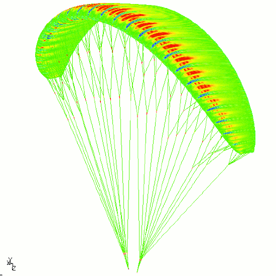
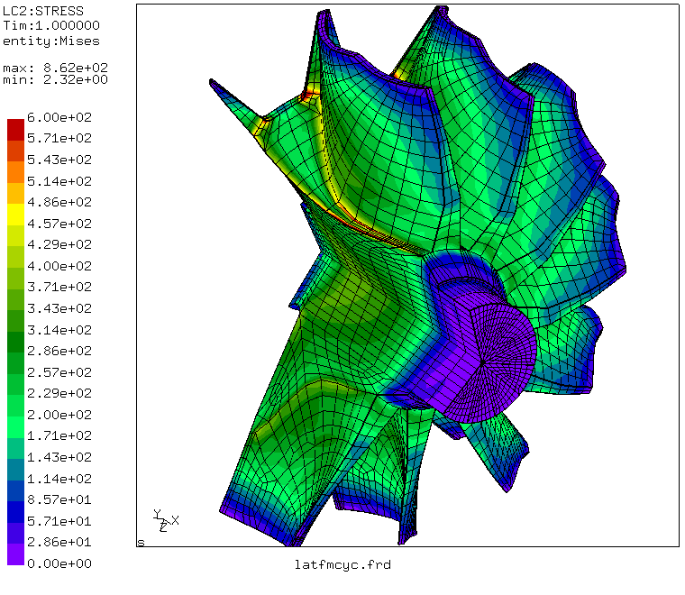

CalculiX: A Three-Dimensional Structural Finite Element Program

CalculiX
--------

A Free Software Three-Dimensional Structural Finite Element Program
-------------------------------------------------------------------

#### Authors:

[Guido Dhondt](authors.htm) (Finite Element Solver)  
Klaus Wittig(Pre- and Postprocessor)

  

* * *

  

### **Version 2.20 of CalculiX is available!**

* * *

  

Maximum principal stress in a paraglider (thanks to Thomas Ripplinger)

* * *

  
**Notice:** The authors acknowledge that naming conventions and input style formats for CalculiX are based on those used by ABAQUS, a proprietary, general purpose finite element code developed and supported by Hibbitt, Karlsson & Sorensen, Inc (HKS) ([http://www.abaqus.com](http://www.abaqus.com)) and are used with kind permission from HKS. Results obtained from CalculiX are in no way connected to ABAQUS.  
  

* * *

  
For a **reference** describing the theory behind CalculiX CrunchiX the user is referred to:  
Dhondt, G. _The Finite Element Method for Three-Dimensional Thermomechanical Applications_, Wiley, 2004.

* * *

  
Click here to get

*   a quick overview of the [pre- and postprocessor.](ov_prepo.htm)
*   a quick overview of the [finite element capabilities](ov_calcu.htm) of CalculiX
*   an overview of [new features in Version 2.20](new_calc.htm) of CalculiX
*   some [example problems](examples.htm) showing you the kind of problems you can solve with CalculiX.

* * *

Available downloads for the graphical interface (CalculiX GraphiX: cgx):

*   [a short installation guide (ASCII)](cgx_2.20.INSTALL)
*   [the source code, documentation (tex) and examples](cgx_2.20.all.tar.bz2)
*   [a Linux executable](cgx_2.20.bz2)
*   [the documentation (pdf)](cgx_2.20.pdf)
*   [the documentation (html)](cgx_2.20.htm.tar.bz2)
*   [examples](cgx_2.20.exa.tar.bz2)
*   [a tutorial (ASCII)](tutorial.txt)
*   for a Windows executable: look at [www.bconverged.com/calculix](http://www.bconverged.com/calculix), [sourceforge.net/projects/calculixforwin](https://sourceforge.net/projects/calculixforwin) or [github.com](https://github.com/GeneralElectric/CalculiX). For an update of the bconverged distribution replace the executables in the bconverged download by the following [files](calculix_2.20_4win.zip) (incl. the CAD converters from Pascal Mossier) .

  

* * *

Available downloads for the solver (CalculiX CrunchiX: ccx):

*   [a short installation guide (ASCII)](ccx_2.20.README.INSTALL)
*   [the source code](ccx_2.20.src.tar.bz2)
*   [a Linux executable](ccx_2.20.tar.bz2)
*   [the documentation (tex)](ccx_2.20.doc.tar.bz2)
*   [the documentation (html)](ccx_2.20.htm.tar.bz2)
*   [the documentation (postscript)](ccx_2.20.ps.tar.bz2)
*   [the documentation (pdf)](ccx_2.20.pdf)
*   [test examples](ccx_2.20.test.tar.bz2)
*   [large fluid test examples for the Finite Element Method](ccx_2.20.fluidtest.tar.bz2)
*   [large structural test examples](ccx_2.20.structest.tar.bz2)
*   [a correction to SPOOLES.2.2 for large input decks](ccx_2.20.SPOOLEScorrection.tar.bz2)
*   for a Windows executable: look at [www.bconverged.com/calculix](http://www.bconverged.com/calculix), [sourceforge.net/projects/calculixforwin](https://sourceforge.net/projects/calculixforwin) or [github.com](https://github.com/GeneralElectric/CalculiX). For an update of the bconverged distribution replace the executables in the bconverged download by the following [files](calculix_2.20_4win.zip) (incl. the CAD converters from Pascal Mossier) .

If you compile the program from scratch using the source code, you will need the source code for the sparse linear equation solver ([SPOOLES.2.2(serial version)](http://www.netlib.org/linalg/spooles/spooles.2.2.html)) and the eigenvalue solver ([ARPACK (serial version)](https://github.com/opencollab/arpack-ng)) too. A new free sparse linear equation solver, [PaStiX](https://gitlab.inria.fr/solverstack/pastix) has been tested and has prove to accelerate execution times up to a factor of 8! To reach this acceleration hwloc, parsec, scotch and PaStiX4CalculiX have to be downloaded and installed. This yields an acceleration up to a factor of 4. For the factor of 8 the CUDA library from Nvidia has to be installed in order to compute on the GPU (only works for Nvidia cards). For details the user should consult the README.INSTALL file.  

* * *

  
Other documentation (not exhaustive):

*   [an installation guide for cgx on Max OS X Mavericks](INST_CGX_2_8_MAC_02_10_2015.pdf) .
*   [an installation guide for ccx on Max OS X Mavericks](INST_CCX_2_8_MAC_02_10_2015.pdf) .

  

* * *

  
Available add-ons:

*   [a STEP-to-fbd, IGES-to-fbd, fbd-to-STEP and fbd-to-IGES converter](cgxCadTools.tar.bz2) (including Linux binaries). If you have questions on this tool please contact [_\[email protected\]_](/cdn-cgi/l/email-protection#c2b2a3b1a1a3aeecafadb1b1aba7b082a5afa3abaeeca1adaf).
*   [a vda to fbd converter](vda2fbd-1.0.tar.gz). After exporting a CAD model in vda format, you can use this program to convert it in fbd format and read it into cgx. If you have questions on this tool please contact [_\[email protected\]_](/cdn-cgi/l/email-protection#305a5f58515e5e55431e5251425e5542704755521e5455).
*   [a acis to fbd converter](acis2fbd.tar.gz). After exporting a CAD model in acis format (available in autoCAD), you can use this program to convert it in fbd format and read it into cgx. Splines and nurbs are not covered yet. This feature was coded by Roland Felde. Many thanks!
*   [a three-dimensional interpolation program](interpol3d.tar.bz2). Interpolates the results from a master frd-file onto the nodes in a slave frd-file.

  

* * *

  
Other software using CalculiX (not exhaustive):

*   [justinablack.com/pycalculix](http://justinablack.com/pycalculix).
*   An [adapter](https://github.com/precice/calculix-adapter) allows to couple CalculiX via [preCICE](http://www.precice.org/) to other solvers (e.g. OpenFOAM, SU2, or any in-house solver) for fluid-structure interaction.

  

* * *

  
A discourse discussion group for CalculiX has been setup. That way you can share problems and experiences with other CalculiX users. To join the group go to [https://calculix.discourse.group](https://calculix.discourse.group).  

* * *

  
For some essential parts of a finite element program such as mathematical solvers, very good source code has been written by people devoting their whole life to it. Therefore, we are especially grateful to those who agreed to have their code included or referred to, specifically (in alphabetical order of the first author):

*   Daniele Amato for the implementation of the crack propagation procedure.
*   C.C. Ashcraft, R.G. Grimes, D.J. Pierce and D.K. Wah for the SPOOLES sparse matrix solver.
*   Johannes Barner for the vda2fbd converter.
*   Jeff Baylor for the Windows executable of cgx and ccx, starting from Version 1.5.
*   Otto-Ernst Bernhardi for the implementation of the C3D8R (hourglass control), the C3D8I element and the box general beam section.
*   M. De Marchi for the Windows executable of ccx, Version 1.2.
*   R. Felde for the acis2fbd converter.
*   Reinhold Fisher for the contact implementation in modal dynamics calculations.
*   B. Graf for the installation guides for Max OS X Mavericks.
*   Jaro Hokkanen for face-to-face penalty contact.
*   Hibbitt, Karlsson & Sorensen, Inc. for allowing us to use the ABAQUS input format.
*   Bora Kamaci for the projection algorithms in the automatic remeshing routines.
*   Sven Kassbohm for the Ciarlet elastic model for large strains.
*   R.B. Lehoucq, D.C. Sorensen and C. Yang for the ARPACK eigenvalue solver.
*   Sascha Merz for the implementation of the Zienkiewicz-Zhu error estimator.
*   Carlo Monjaraz-Tec for work on explicit dynamics.
*   Pascal Mossier for the cadTools.
*   Conrad Mottl for implementing multistage MPC's.
*   Yannick Muller for the implementation of aerodynamic networks.
*   Tobias Opel for work on the PaStiX-CalculiX interface.
*   Matteo Pacher for work on implicit dynamics.
*   Vito Pasquariello for the Coulomb friction in penalty contact.
*   Hugo Pfoertner for fminsi (minimization of functions; lgpl applies).
*   Axel Philipp for the external face extraction within an existing mesh (cgx).
*   Samoela Rakotonanahary for auxiliary routines in face-to-face penalty contact.
*   Gil Rama for the us3 shell element.
*   Ernst Rank and Martin Ruecker for the C-version of the iterative solver.
*   T. Roesener, who found a way for stepped colors in Linux.
*   Tobias Roessler for detecting a very mean error in the CalculiX-Mortar interface.
*   Dave Rossi for the Windows executable of ccx, Version 1.1.
*   Tarik Sahin for the mesh refinement algorithm.
*   Stefan Sicklinger for modifications in penalty contact.
*   Saskia Sitzmann for the implementation of the Sutherland-Hodgman algorithm and Mortar contact.
*   Manfred Spraul for generating the rmp archives, enhancements in the numcheck.awk script and the multithreading capability.
*   Scott W. Sloan for the profile reduction algorithms.
*   Robert Taylor for the permission to use his profile solver (included up to version 1.7).
*   Peter Wauligmann for discovering, linking and improving the PaStiX solver.
*   Xinan Zhou for supporting me with the wedge element implementation.

The use of Transactions of Mathematical Software (TOMS) routines 496 (lzhes), 581 (hybsvd) and 584 (cubtri) is gratefully acknowledged. Appropriate references have been included in the [User's Manual](ccx_2.20.ps.tar.bz2).

Material data can be found at [www.matweb.com](http://www.matweb.com).

Finally, the authors would like to thank MTU Aero Engines for the permission to publish this work.

* * *

  
Here you find the text of the [GNU GENERAL PUBLIC LICENSE Version 2](gpl-2.0.txt)  
  

* * *

  

Von Mises stress in a turbine segment

* * *

  

#### **If you have any comments or suggestions, or if you would like to contribute to this project, please contact us!  

* * *

  
[Legal Disclosure](legaldisclosure.txt)  
[Privacy Policy](privacypolicy.txt)  
  
[Back to the CalculiX home page](http://www.calculix.de)
